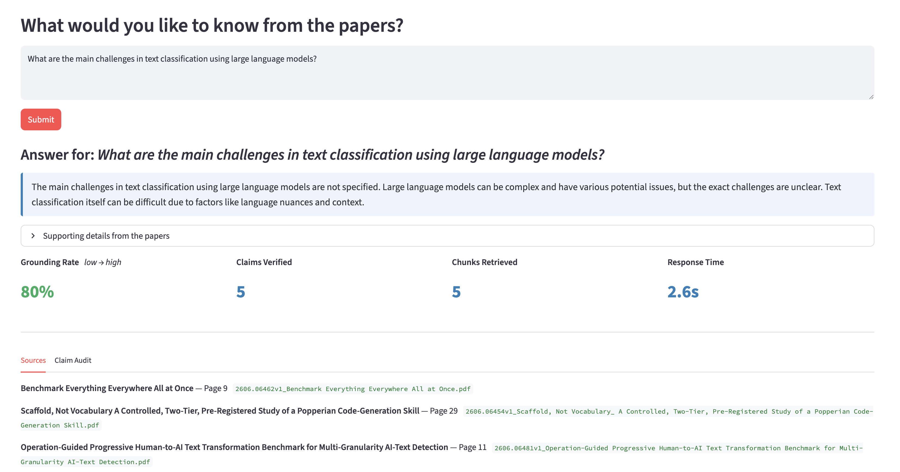
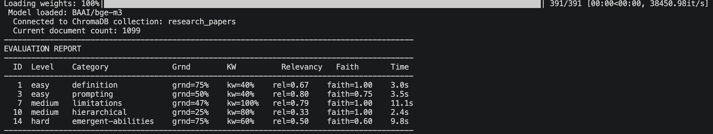

# Claim From Papers

This project is a proof-of-concept RAG system that not only answers questions based on research papers but also provides transparent claim verification for each part of the answer. It independently checks factual claims in the generated answer against retrieved research-paper evidence and reports whether they are Grounded, Unverified, or Contradicted.



### Motivation

With the rise of LLMs, there's a growing concern about hallucinations and misinformation.

A RAG pipeline reduces that risk, but does not eliminate it.

This project goes one step further: after the answer is generated, each atomic claim is independently re-verified against the vector store. The result is a transparent "Claim Grounding Rate" that quantifies exactly how much of the answer is traceable to the source material.


### How It Works

1. **Knowledge Base**: The app starts with a knowledge base of 30 arXiv papers on "Text Classification using Large Language Models" (topic can be changed based on user preference), processed into chunks and stored as BGE-M3 embeddings in ChromaDB.
2. **User Interaction**: Users can ask any question related to the topic, and the system will fetch relevant information from the papers to generate an answer. Also, users can upload their own PDFs to expand the knowledge base.
3. **Retrieval**: The user's question is embedded and semantically matched to the top-K most relevant chunks.
4. **Generation**: A prompt containing the retrieved chunks is sent to `openai/gpt-oss-120b` via Groq to generate an answer grounded in the retrieved research-paper context. A second LLM call produces a concise summary (`short_answer`) without source citations for easier reading.
5. **Claim Extraction**: The answer is decomposed into atomic factual claims using the same LLM.
6. **Claim Verification**: Each claim is independently searched against ChromaDB. A high-similarity chunk triggers an LLM fact-check that labels the claim as Grounded, Unverified, or Contradicted.
7. **Claim Grounding Rate**: The fraction of grounded claims is returned alongside the answer as a single transparency metric.

## Technologies Used

- **Language**: Python 3.13
- **LLM API**: Groq (`openai/gpt-oss-120b`)
- **Embeddings**: BGE-M3 (local, no API cost)
- **Vector Database**: ChromaDB
- **Web Framework**: FastAPI
- **Frontend**: Streamlit
- **PDF Processing**: PyMuPDF (fitz)
- **Paper Downloading**: arXiv API
- **Evaluation**: DeepEval

### LLM Model
- The project currently uses `openai/gpt-oss-120b` through Groq. The project originally used Llama 3.3 70B Versatile, but migrated to GPT-OSS 120B after the Llama model was deprecated. 
- GPT-OSS generation uses `max_completion_tokens` and low reasoning effort to support answer generation, claim extraction, claim verification, and summarization.

## Project Structure

```
claim-from-papers/
├── README.md                     # Project overview and instructions
├── requirements.txt              # Python dependencies
├── streamlit_app.py              # Streamlit UI
│
├── app/
│   ├── main.py                   # FastAPI application entry point
│   ├── api/
│   │   ├── documents.py          # POST /papers/upload, GET /papers/list
│   │   └── rag.py                # POST /query/ask, POST /query/stream
│   ├── ingestion/
│   │   ├── ingest_and_vectorize.py   # Download papers + embed and index into ChromaDB
│   │   ├── downloader.py         # arXiv paper downloader
│   │   ├── parser.py             # PDF text extraction with page metadata
│   │   └── chunker.py            # Text chunking + ChromaDB VectorStore
│   ├── rag/
│   │   ├── retriever.py          # Semantic search against ChromaDB
│   │   ├── generator.py          # Groq LLM answer generation
│   │   ├── prompt_builder.py     # Prompt and message construction
│   │   └── pipeline.py           # End-to-end RAG orchestration
│   └── verification/
│       ├── claim_extractor.py    # Decompose answer into atomic claims
│       └── claim_verifier.py     # Verify each claim against vector store
│
├── config/
│   └── settings.py               # Application settings and constants
│
├── data/
│   └── papers/                   # Downloaded PDF files (research papers)
│
├── vectorstore/                  # ChromaDB persistent storage
│   └── chroma.sqlite3            # Vector embeddings database
│
├── evaluation/
│   ├── test_cases.py             # 15 test questions across 3 difficulty levels
│   ├── evaluator.py              # Runs pipeline + measures all metrics
│   └── results.json              # Saved evaluation results (JSON)
│
└── tests/                        # Unit and integration tests
    ├── conftest.py               # Shared pytest fixtures
    ├── test_ingestion.py         # Ingestion pipeline tests
    └── test_rag.py               # RAG pipeline tests
```

## Quick Start

### Prerequisites

- Python 3.12+
- Groq API key with access to `openai/gpt-oss-120b`

### Installation

```bash
# Navigate into the project
cd claim-from-papers

# Create and activate virtual environment
python3 -m venv venv
source venv/bin/activate

# Install all dependencies
pip install -r requirements.txt

# Create .env with your Groq API key
echo "GROQ_API_KEY=your_key_here" > .env
```

### Run the Application

Before starting, ensure you have at least 30 papers in `data/papers/` or run the ingestion script to download and process them (see Vector Store section below).

**Terminal 1 — FastAPI backend:**
```bash
source venv/bin/activate
uvicorn app.main:app --reload --host 0.0.0.0 --port 8000
```

**Terminal 2 — Streamlit UI:**
```bash
source venv/bin/activate
streamlit run streamlit_app.py
```

- Streamlit UI: http://localhost:8501
- API docs (Swagger): http://localhost:8000/docs


## Vector Store

| Property | Value |
|---|---|
| Location | `vectorstore/` |
| Collection | `research_papers` |
| Embedding model | BGE-M3 (1024 dimensions) |
| Chunk size | 500 tokens with 50-token overlap |
| Source documents | 30 arXiv PDFs on text classification using LLMs (2024-2026) |

To rebuild from scratch:
```bash
python app/ingestion/ingest_and_vectorize.py                  # download + embed and store
python app/ingestion/ingest_and_vectorize.py --skip-download  # re-index only
```

## Evaluation
The evaluation suite contains 15 questions across easy, medium, and hard difficulty levels. A selected subset can be evaluated for:
- **Claim Grounding Rate** - fraction of extracted claims verified as grounded
- **Keyword Coverage** - fraction of expected keywords present in the answer
- **Answer Relevancy** - DeepEval metric
- **Faithfulness** - DeepEval metric

```bash
source venv/bin/activate
python evaluation/evaluator.py
```

The previous evaluation results were produced using the earlier Llama 3.3 70B configuration:




## API Reference

| Method | Endpoint | Description |
|---|---|---|
| POST | /query/ask | Ask a question → answer + claims + grounding rate |
| POST | /query/stream | Same with streaming response |
| POST | /papers/upload | Upload a PDF to expand the knowledge base |
| GET | /papers/list | List all papers in the library |


## Tests

### Test files

| File | What it covers |
|---|---|
| `tests/conftest.py` | Session-scoped fixtures shared across all test files |
| `tests/test_ingestion.py` | `ArxivDownloader`, `PDFParser`, `TextChunker`, `VectorStore` |
| `tests/test_rag.py` | `Retriever`, `PromptBuilder`, `Generator`, `RAGPipeline` |

### How the fixtures work

`conftest.py` provides session-scoped fixtures so test data is prepared once and reused:

1. Attempts to download 5 arXiv papers into `data/test/` at the start of the session.
2. If arXiv is unavailable (rate-limited or returns an error), automatically falls back to copying 5 papers from `data/papers/` so tests can still run offline.
3. Shares those papers across every test class that needs them.
4. Deletes `data/test/` automatically after all tests complete.

Tests that depend on real PDFs are skipped gracefully (not failed) when no papers are available from either source.

### Running tests

```bash
# Run all tests
pytest tests/ -v

# Run a specific file
pytest tests/test_rag.py -v

# Run a specific class
pytest tests/test_rag.py::TestRetriever -v
```

## Why this is different

Standard RAG gives you an answer.

**Claim From Papers gives you an answer, then independently checks how well its factual claims are supported by the research-paper knowledge base.**